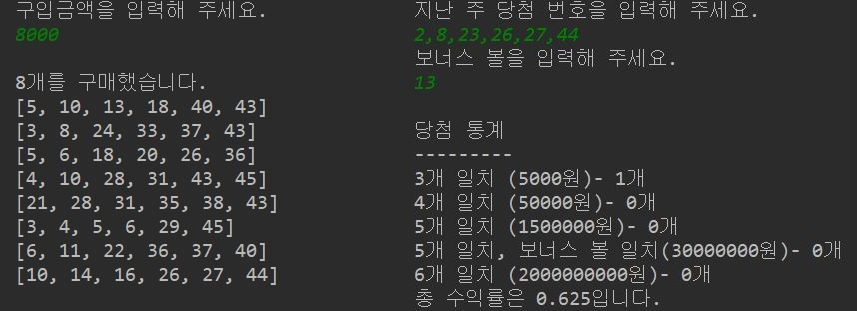

# 로또

## 소개
   * 가상으로 로또를 사보고 지난주 로또 번호와 비교해서 수익률을 구해보자

## 실행 화면   
   

## 기능 목록

   * 사용자의 구입금액을 입력받는다.
        - 1,000원 미만, 10만원 이상인 경우 종료
        - 숫자가 아닌 경우 종료
        - 1,000의 배수가 아닌 경우 종료
       
   * 로또 구입 장수 만큼 로또번호를 발급한다.
       
   * 로또 번호 6개의 숫자를 콤마(,) 로 구분해서 입력받는다.
        - 숫자가 아닌 경우 종료
        - 45 이하의 양수가 아닌 경우 종료
        - 중복 없이 6개의 번호가 아닌 경우 종료
     
   * 보너스 번호를 입력받는다.
        - 숫자가 아닌 경우 종료
        - 45 이하의 양수가 아닌 경우 종료
        - 로또 번호와 중복된 번호를 입력받으면 종료
     
   * 발급한 로또 번호와 입력받은 로또 번호를 비교한다.
       
   * 수익율을 계산한다.