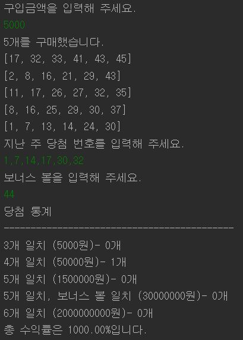

## 로또 게임
로또를 구매하여 당첨결과를 확인하고 그에 따른 수익률을 계산하는 게임

로또 1장의 가격은 1000원이며, 로또 구입개수에 제한은 없다. 
당첨금액은 다음과 같다. 
1등 - 2,000,000,000원 
2등 - 30,000,000원 
3등 - 1,500,000원 
4등 - 50,000원 
5등 - 5,000원

## 구현할 기능 목록
- 로또구입에 사용할 금액을 입력한다. (거스름돈은 돌려주는 것으로 한다.)
- 로또구입금액에 0 이상의 정수 1개가 들어왔는지 검증한다.
- 1 ~ 45 사이의 중복되지 않는 임의의 정수 6개(로또번호)를 생성한다.
- 로또번호를 오름차순으로 정렬하여 로또를 생성한다.
- 로또구입 갯수만큼 로또를 생성한다.
- 구매한 로또 개수 및 로또번호 출력한다.
- 1 ~ 45 사이의 정수 6개를 입력한다. (당첨번호)
- 입력한 당첨번호를 쉼표 기준으로 분리한다.
- 1 ~ 45 사이의 중복되지 않는 정수가 6개 입력되었는지 검증한다.
- 1 ~ 45 사이의 정수 1개를 입력한다. (보너스 볼)
- 1 ~ 45 사이의 당첨번호와 중복되지 않는 정수 1개가 입력되었는지 검증한다.
- 로또번호와 당첨번호를 비교하여 서로 일치하는 수의 개수를 구한다.
- 로또번호가 보너스 번호를 포함하는지 판단한다. 
- 당첨결과를 출력한다.
- 총 로또당첨금액을 구한다.
- 총 수익률을 계산하고 출력한다.

## 실행결과

