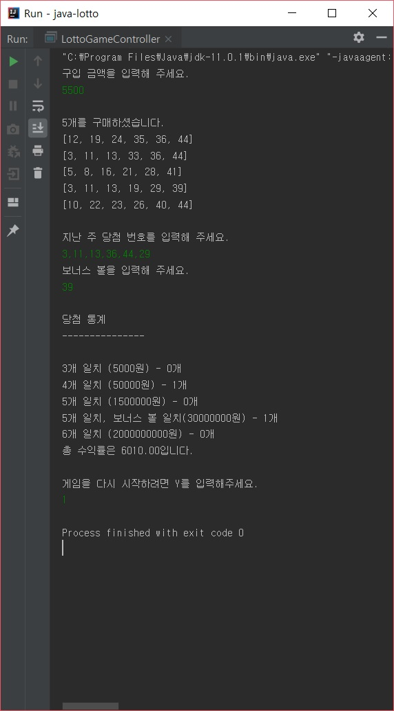
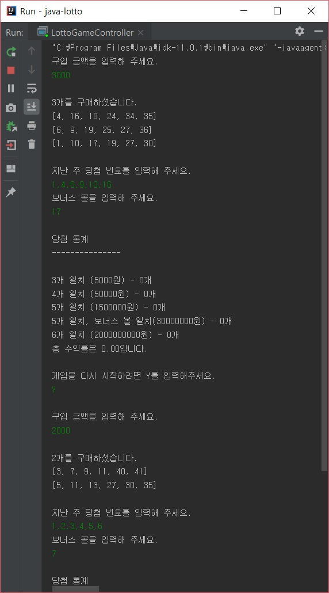
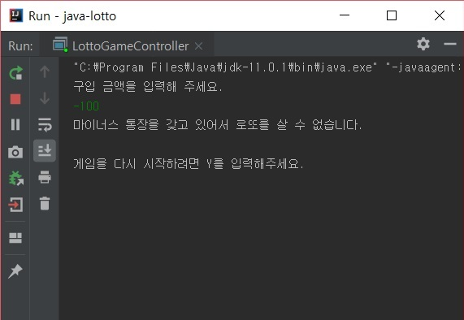
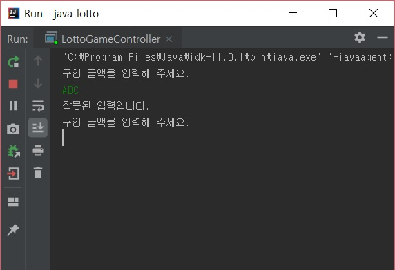
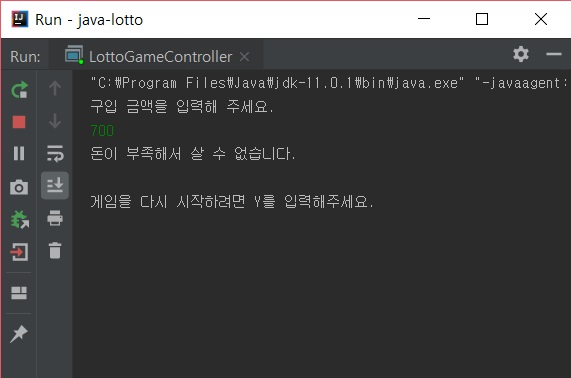
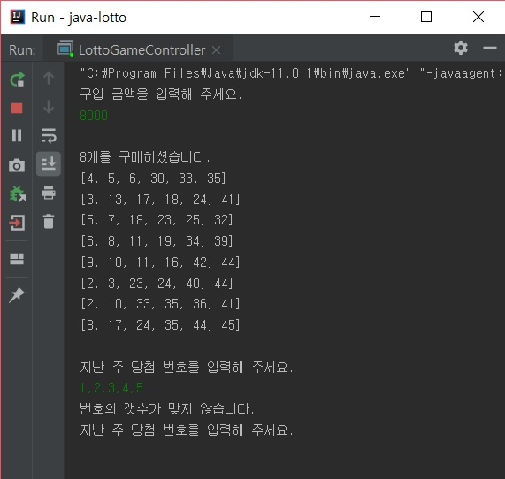
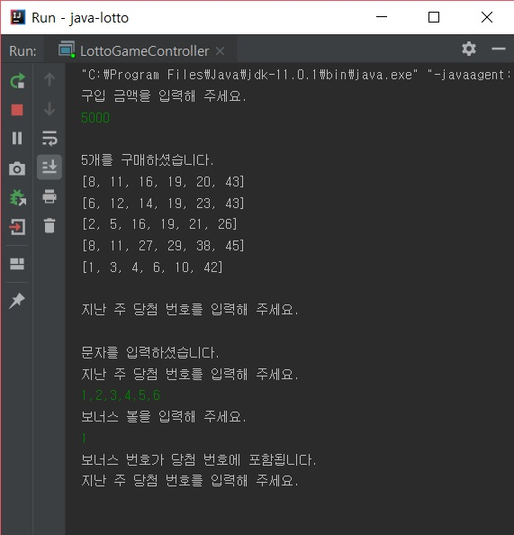

# 2주차 미션 - 자동차 경주 게임

### 구현할 기능

1. 구입금액 입력
2. 구입금액에 대한 예외 처리 (1000원 미만, 음수, 0, 문자)
3. 구매할 수 있는 수만큼 랜덤을 이용하여 로또 번호 생성
4. 구매한 로또 번호 출력
5. 당첨 번호 입력
6. 당첨 번호에 대한 예외 처리 (번호 갯수, 음수, 0, 문자)
7. 보너스볼 입력
8. 보너스볼에 대한 예외 처리 (당첨 번호와 일치, 음수, 0, 문자)
9. 당첨 통계 출력
10. 수익률 계산
11. 다시 시작

### 기능 요구사항

1. 로또 게임 기능을 구현해야 한다.

2. 로또 구입 금액을 입력하면 구입 금액에 해당하는 로또를 발급해야 한다.

3. 로또 1장의 가격은 1000원이다.

4. 로또 당첨 금액은 고정되어 있는 것으로 가정한다.

5. 수익률을 계산해 출력해야 한다.

   

### 프로그래밍 요구사항

1. 자바 코드 컨벤션을 지키면서 프로그래밍한다.

2. indent depth를 2이 넘지 않도록 구현한다.
1까지만 허용한다.

3. 함수의 길이가 10라인을 넘어가지 않도록 구현한다.

4. else 예약어를 쓰지 않는다.

5. 함수 (또는 메소드)의 인자 수를 3개까지만 허용한다.

6. 값을 하드코딩하지 않는다.

7. 자바 API를 적극 활용한다.

8. 객체에 메시지를 보낸다. (데이터를 get하지
않는다.)

9. 필드 (인스턴스 변수)의 수를 줄이기 위해
노력한다.

10. 발생할 수 있는 예외케이스에 대해 고민한다.

### 게임 화면

##### 정상적인 게임

##### 다시 시작 기능

##### 음수 입력 예외처리

##### 문자 입력 예외처리

##### 돈이 부족할 때 예외처리

##### 잘못된 범위의 당첨번호 예외처리

##### 잘못된 갯수의 당첨번호 예외처리

##### 당첨 번호에 보너스 번호가 포함될 경우 예외처리

