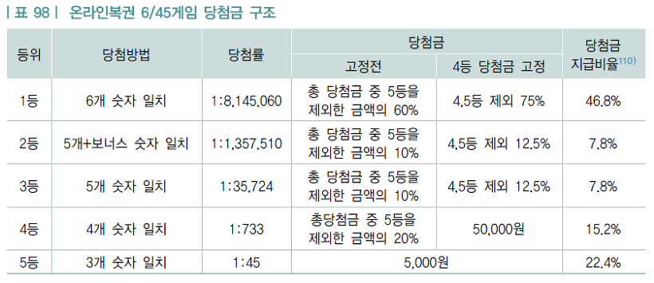
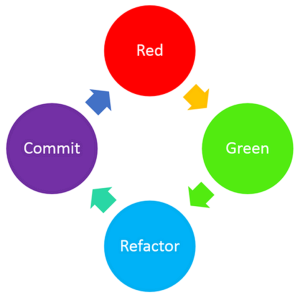

# 우아한테크코스 프리코스 3주차 미션 - 로또

### 프로젝트 개요

> 본 프로젝트는 우아한형제들에서 주관하는 우아한테크코스 1기의 
프리코스 3주차 미션을 제 방식으로 해결한 것입니다.

Java 프로그래밍 언어를 이용하여 로또 게임을 개발합니다.

로또 게임은 대한민국의 로또 시스템을 반영합니다. 즉, 45개의 숫자 중 
임의로 6개의 숫자가 당첨 숫자가 되며, 이를 모두 맞추면 1등입니다. 더 자세한 
규칙은 아래에 이미지(출처: https://lottogame.tistory.com/35)를 첨부합니다.

### 선행 학습
- 이번 주 미션에 추가된 요구사항을 충족하기 위해 다음의 항목들을 Googling 과 책을 통해 학습했습니다.
  - 자바 API
  - 자바 Collection Frameworks
  - 제네릭
  - 예외 처리 (try-catch / throw, throws)

지난 주 미션부터 테스트 주도 개발(이하 TDD)를 적용하여 개발하고 있습니다. 지난 미션에서는 
TDD의 각 단계가 끝날 때마다 커밋을 진행하였더니 무의미하게 커밋이 많아지는 문제가 생겼습니다. 
(예를 들어, A 라는 기능을 개발한다고 하면 "A 기능 테스트 작성", "A 기능 컴파일 성공, 테스트 실패", "A 기능 테스트 성공",
 "A 기능 리팩토링" ) 이와 같은 방식은 한 눈에 파악하기 불편할 뿐만 아니라 다른 개발자들이
 이 커밋 메세지들을 보았을 때 굳이 제가 TDD의 각 스텝을 사용했다는 것을 알고 싶지도 않을 것 같다는 생각이 들었습니다.
 
이 문제를 해결하기 위해 Googling을 하였고, 한 블로그(출처: https://ardalis.com/rgrc-is-the-new-red-green-refactor-for-test-first-development)에서 RGRC 라는 TDD 개발 단계를 제시하는 것을 발견했습니다. RGRC 는 
"Red-Green-Refactor-Commit" 의 약자입니다. Red 는 테스트만을 작성한 상태이고, Green 은 그 테스트를 통과하는 프로그램을 
작성한 상태입니다. Refactor와 Commit은 문자 그대로를 의미합니다. 즉, TDD의 한 주기(Cycle)가 끝나고 나서야 커밋을 하는 
개발 방법론입니다. 이 방식을 채택해 커밋 메시지를 관리합니다.

### 기능 구현 목록
- 사용자로부터 로또 구입 금액을 입력받는다.
- 로또 구입 금액이 올바른지 검사한다. (로또 가격이 1000원 이므로, 1000원으로 나누어 떨어져야 한다.)
- 로또 한 개를 무작위로 발급한다.
- 로또 구입 금액에 해당하는 수 만큼의 로또를 발급한다.
- 로또 번호를 출력한다.
- 로또 번호들을 출력한다.
- 사용자로부터 당첨 번호를 입력받는다.
- 당첨 번호가 적절한지 검사한다. (당첨 번호는 1~45 사이의 6개의 서로 다른 숫자여야한다.)
- 사용자로부터 보너스 번호를 입력받는다.
- 보너스 번호가 적절한지 검사한다. (보너스 번호는 1~45 사이의 1개의 숫자여야한다.)
- 로또 한 개를 당첨 번호, 보너스 번호와 비교하여 몇 등에 해당하는지(즉, 당첨 여부) 계산한다.
- 발급받은 로또 전부의 당첨 여부를 계산한다.
- 당첨 통계를 출력한다.
- 수익률을 계산한다.