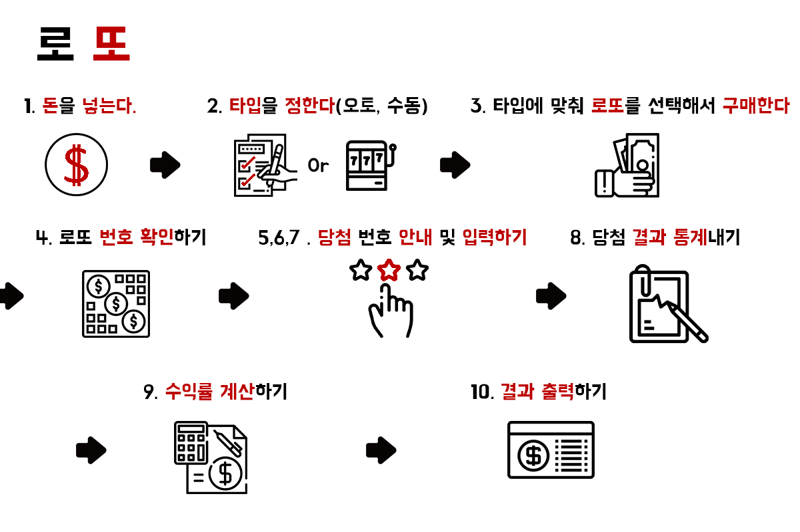

로또 (New Version)
=================

실행 과정
----------------

기능 요구
---------
* 로또 게임 기능을 구현해야 한다. 규칙을 모르면 검색해 로또 규칙을 찾아본다.
* 로또 구입 금액을 입력하면 구입 금액에 해당하는 로또를 발급 해야한다.
* 로또 1장의 가격은 1000원이다.
* 로또 당첨금액은 고정 되어있는것으로 가정한다.
* 수익률을 계산해 출력해야 한다

기능 단위 commit
---------------
- [x] 마크다운 작성 & 패키지 구성
- [x] 게임 생성
- [x] 구매 금액 입력 받기
- [x] 자동 배열 생성
- [x] 수동 배열 생성
- [x] 구매한 번호 출력
- [x] 당첨 번호와 보너스 번호 입력
- [x] 당첨 통계
- [x] 수익률 계산
- [x] 당첨 통계 출력 