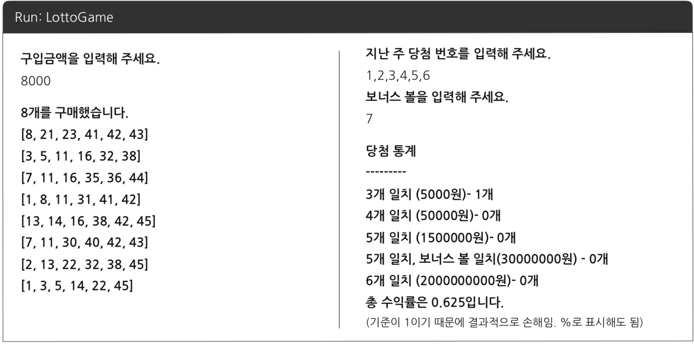

# Java Lotto

- 적은 금액에 해당하는 로또를 산다.
- 지난 주 당첨 번호를 적는다.
- 당첨된 금액과 수익률을 출력해준다.

## 1. 기능 구현

- 로또 구입 관련 기능

    - 로또 구입 금액을 입력 받는 기능
    - 금액이 1000원 아래인 경우 예외 처리
    - 숫자가 아닌 다른 값, 음수인 값일 경우 예외 처리
    - 로또를 사고 남은 거스돈 처리 예외
    - 가격에 맞는 로또 구입 및 출력 기능
    - 번호가 생성이 제대로 안될 경우의 예외 처리

- 번호 입력 관련 기능

    - 지난주 당첨 번호 6개, 보너스 볼 1개 입력 받는 기능
    - 총 7개의 숫자보다 많은 숫자 또는 숫자가 아닌 값을 입력시 예외 처리
    - 7개의 숫자가 중복되는지 확인 하는 기능

- 당첨 통계 관련 기능

    - 당첨된 금액과 나머지 출력
    - 수익률 소수점 3자리까지 계산해 출력해야 한다.
    - 손해 여부 판단하는 기능

## 4. 클래스

## 5. 메소드

